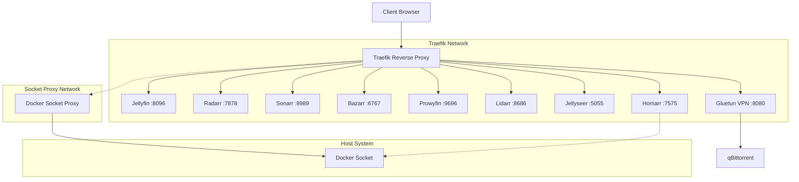

# Parr - Personal Arr stack

A complete *arr stack/media server setup with [Traefik](https://github.com/traefik/traefik) reverse proxy, including [Jellyfin](https://github.com/jellyfin/jellyfin), [Sonarr](https://github.com/Sonarr/Sonarr), [Radarr](https://github.com/Radarr/Radarr), [Bazarr](https://github.com/morpheus65535/bazarr), [Lidarr](https://github.com/Lidarr/Lidarr), [Prowlarr](https://github.com/Prowlarr/Prowlarr), [Jellyseer](https://github.com/Fallenbagel/jellyseerr), [Homarr](https://github.com/ajnart/homarr), and [qBittorrent](https://github.com/qbittorrent/qBittorrent) with VPN support.


## Architecture Overview



## Quick Setup

### 1. Run the Setup Script

```bash
./setup.sh
```

This interactive script will:
- Configure your timezone and hostname
- **Choose installation type**: Service (systemctl) or Docker Stack
- Set up directory paths for data and configs
- Configure VPN settings for qBittorrent
- Create necessary directories
- Generate the `.env` file
- **If Service mode**: Install and enable systemd service for automatic startup

#### Installation Types:

**Service Mode (Recommended)**:
- Installs as a systemd service for automatic startup
- Manages the stack with `systemctl` commands
- Better for always-on setups
- Automatically starts on system boot

**Docker Stack Mode**:
- Manual `docker-compose` management
- Better for development or occasional use
- More direct control over containers

### 2. Start the Services

**For Service Installation**:
```bash
sudo systemctl start arr@<directory-name>
# Example: sudo systemctl start arr@parr
```

**For Docker Stack Installation**:
```bash
docker-compose up -d
```

**Note**: The setup script will show you the exact commands to use based on your chosen installation type.

### 3. Update the Stack

To update all services to their latest versions:

```bash
./update.sh
```

This script will:
- Detect your installation type automatically
- Stop the services safely (systemctl or docker-compose)
- Pull the latest Docker images
- Restart all services
- Perform health checks to ensure everything is running

### 4. Configure Local DNS

Add your hostname to your local DNS or hosts file:

**Linux/macOS:**
```bash
echo "192.168.1.100 your-hostname.local" | sudo tee -a /etc/hosts
```

**Windows:**
Add to `C:\Windows\System32\drivers\etc\hosts`:
```
192.168.1.100 your-hostname.local
```

## Service Access

Once configured, access your services at:

- **Traefik Dashboard**: `http://localhost:8081`
- **Jellyfin**: `http://your-hostname.local/jellyfin` ⚠️ *Needs verification*
- **Radarr**: `http://your-hostname.local/radarr` ✅
- **Sonarr**: `http://your-hostname.local/sonarr` ✅
- **Bazarr**: `http://your-hostname.local/bazarr` ✅
- **Lidarr**: `http://your-hostname.local/lidarr` ✅
- **Prowlarr**: `http://your-hostname.local/prowlarr` ✅
- **Jellyseer**: `http://your-hostname.local/jellyseer` ❌ *No reverse proxy support*
- **Homarr**: `http://your-hostname.local/homarr` ❌ *Routing issues*
- **qBittorrent**: `http://your-hostname.local/qbittorrent` ✅

**Note**: Services marked with ❌ or ⚠️ may require additional configuration or have known issues with reverse proxy routing.

## Manual Configuration

If you prefer manual setup:

1. Copy `.env.sample` to `.env`
2. Edit `.env` with your settings
3. Run `./create-volumes.sh` to create directories
4. Run `docker-compose up -d`

## Directory Structure

The setup creates the following structure:

### Configuration Directory
```
/your-config-dir/
├── prowlarr/
├── radarr/
├── sonarr/
├── bazarr/
├── lidarr/
├── jellyfin/
├── jellyseer/
├── homarr/
├── gluetun/
└── qbittorent/
```

### Data Directory
```
/your-data-dir/
├── torrents
│   ├── books
│   ├── movies
│   ├── music
│   └── tv
├── usenet
│   ├── incomplete
│   └── complete
│       ├── books
│       ├── movies
│       ├── music
│       └── tv
└── media
    ├── books
    ├── movies
    ├── music
    └── tv
```

**Directory Purpose:**
- **torrents/**: Download location for torrent clients (qBittorrent)
- **usenet/**: Download locations for usenet clients (SABnzbd, NZBGet)
  - **incomplete/**: Temporary files during download
  - **complete/**: Completed downloads before processing
- **media/**: Final organized media files for consumption (Jellyfin, Plex, etc.)

## VPN Configuration (Gluetun + ProtonVPN)

This setup uses Gluetun with ProtonVPN to secure qBittorrent traffic. All info based from [the_definitive_howto_for_setting_up_protonvpn on reddit](https://www.reddit.com/r/gluetun/comments/1kpbfs2/the_definitive_howto_for_setting_up_protonvpn/) from (u/sboger)[https://www.reddit.com/user/sboger/]. You need a proton plus account to use port forwarding.
Follow these steps to configure your VPN: 

### 1. Get ProtonVPN Credentials

1. **Login to ProtonVPN**: Go to [account.protonvpn.com](https://account.protonvpn.com)
2. **Navigate to Downloads**: Go to Downloads → OpenVPN configuration files
3. **Get OpenVPN Credentials**: 
   - Username: `your_username+pmp` (note the `+pmp` suffix for port forwarding)
   - Password: Your OpenVPN password (different from account password)

### 2. Configure WireGuard (Recommended)

**For WireGuard (faster and more reliable):**

1. **Create WireGuard Configuration**: 
   - Go to Downloads → WireGuard configuration
   - Click "Create new WireGuard configuration"
   - **Platform**: Select "Router"
   - **Protocol**: Leave default (no filtering needed)
   - **Features**: Select "NAT-PMP (Port Forwarding)"
   - **VPN Accelerator**: **Deselect/Disable** this option
   - Click "Create"

2. **Extract Private Key**: 
   - A popup will display the WireGuard configuration
   - Find the line starting with `PrivateKey = `
   - Copy the entire key (looks like: `wOEI9rqqbDwnN8/Bpp22sVz48T71vJ4fYmFWujulwUU=`)
   - **Important**: Keep this key secure and private

3. **Update .env file**:
   ```bash
   VPN_TYPE=wireguard
   WIREGUARD_PRIVATE_KEY=your_actual_private_key_here
   SERVER_COUNTRIES=Albania,Algeria,Angola,Argentina,Australia,Austria,Azerbaijan

   ```

set SERVER_COUNTRIES to your preference. Run 'docker run --rm -v eraseme:/gluetun qmcgaw/gluetun format-servers -protonvpn' to get a list of server countries

### 3. Configure OpenVPN (Alternative)

**For OpenVPN:**

1. **Update .env file**:
   ```bash
   VPN_TYPE=openvpn
   OPENVPN_USER=your_username+pmp
   OPENVPN_PASSWORD=your_openvpn_password
   SERVER_COUNTRIES=Netherlands,Switzerland,Sweden
   ```

### 4. Choose Server Countries

**Important**: Use countries that allow P2P traffic:
- ✅ **Recommended**: Netherlands, Switzerland, Sweden, Iceland, Spain
- ❌ **Avoid**: US, UK, Australia, Germany (may have P2P restrictions)

**Get available countries**:
```bash
docker run --rm qmcgaw/gluetun:v3 format-servers -protonvpn
```

### 5. Test VPN Connection

1. **Start Gluetun**:
   ```bash
   docker-compose up -d gluetun
   ```

2. **Check logs**:
   ```bash
   docker-compose logs gluetun
   ```

3. **Verify connection**: Look for:
   - `Wireguard setup is complete` (for WireGuard)
   - `TUN/TAP device opened` (for OpenVPN)
   - No repeated connection errors

4. **Check IP**: 
   ```bash
   docker-compose exec gluetun wget -qO- https://ipinfo.io
   ```
   Should show VPN server location, not your real IP.

### 6. Port Forwarding

Port forwarding is automatically configured for better torrent performance:
- Gluetun will automatically get a forwarded port from ProtonVPN
- qBittorrent will be automatically configured to use this port
- Check logs for: `Port forwarding is enabled`

### 7. First Run qBittorrent Setup

**IMPORTANT**: The first run will fail to set the port until you configure qBittorrent settings.

1. **Get temporary password**:
   ```bash
   docker-compose logs qbittorrent | grep "temporary password"
   ```
   Look for: `The WebUI administrator password was not set. A temporary password is provided for this session: [PASSWORD]`

2. **Access qBittorrent WebUI**:
   - Go to `http://your-hostname/qbittorrent` (via Traefik)
   - Or `http://localhost:8080` (direct access)
   - Username: `admin`
   - Password: [temporary password from logs]

3. **Configure WebUI settings**:
   - Click the blue circle gear icon (⚙️) for Options
   - Go to the **WebUI** tab
   - Set your own username and password
   - **Important**: Check "Bypass authentication for clients on localhost"
   - Scroll down and click **Save**

4. **Restart services**:
   ```bash
   docker-compose restart gluetun qbittorrent
   ```

After this setup, port forwarding will work correctly and qBittorrent will use the forwarded port from ProtonVPN automatically.

### Configuring Base URLs for *arr Applications

After starting the services, you need to configure the base URL for each *arr application to work properly with reverse proxy routing:

1. **Access each service directly** using `http://localhost:PORT`:
   - **Radarr**: `http://localhost:7878`
   - **Sonarr**: `http://localhost:8989`
   - **Bazarr**: `http://localhost:6767`
   - **Lidarr**: `http://localhost:8686`
   - **Prowlarr**: `http://localhost:9696`
   - **Jellyfin**: `http://localhost:8096`

2. **Configure Base URL** in each application:
   - Go to **Settings** → **General** (for *arr apps)
   - Find **URL Base** or **Base URL** setting
   - Set it to the service path: `/radarr`, `/sonarr`, `/bazarr`, etc.
   - **Save** and **restart** the service

3. **For Jellyfin**:
   - Go to **Dashboard** → **Networking**
   - Set **Base URL** to `/jellyfin`
   - Save and restart

4. **Restart services** after configuration:
   ```bash
   docker-compose restart radarr sonarr bazarr lidarr prowlarr jellyfin
   ```

Once configured, the services will work properly through the reverse proxy at `http://your-hostname.local/servicename`.

### Troubleshooting VPN Issues

**Connection fails**:
- Verify credentials are correct
- Try different server countries
- Check if your ProtonVPN plan supports P2P

**Slow speeds**:
- Try WireGuard instead of OpenVPN
- Choose servers closer to your location
- Ensure port forwarding is working

**qBittorrent can't connect**:
- Check Gluetun health status: `docker-compose ps gluetun`
- Verify qBittorrent is using Gluetun's network
- Complete the first run setup (see section 7 above)
- Check port forwarding in qBittorrent settings

**DNS issues**:
```bash
# Test DNS resolution through VPN
docker-compose exec gluetun nslookup google.com
```


## Additional Troubleshooting

### Docker Version Issues

Found that docker version >= 28.0.0 makes containers using gluetun lose connection in Raspbian

To check you current version run
apt list --installed docker-ce

 To downgrade your docker to 27.5.1, run:

sudo apt install docker-compose-plugin=2.32.4-1~debian.12~bookworm docker-ce-cli=5:27.5.1-1~debian.12~bookworm docker-buildx-plugin=0.20.0-1~debian.12~bookworm docker-ce=5:27.5.1-1~debian.12~bookworm docker-ce-rootless-extras=5:27.5.1-1~debian.12~bookworm

Run sudo systemctl restart docker and check if this fixed your problem.

To make sure these packages don't upgrade, run:

sudo apt-mark hold docker-compose-plugin=2.32.4-1~debian.12~bookworm docker-ce-cli=5:27.5.1-1~debian.12~bookworm docker-buildx-plugin=0.20.0-1~debian.12~bookworm docker-ce=5:27.5.1-1~debian.12~bookworm docker-ce-rootless-extras=5:27.5.1-1~debian.12~bookworm

If you ever want them to start upgrading again, run the same command with unhold instead of hold 
